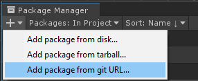
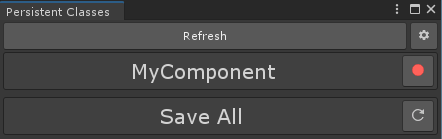

# ZSaver
ZSaver is an easy, all-in-one Serialization solution for Unity. It supports serialization for every one of Unity's built in Components, and an easy way of Serializing your own!
## Installation
To get started, simply [right click me and select "Copy this link address"](https://github.com/Ziplaw/ZSave.git), go into the **Package Manager**, click on the **+** icon and select "Add package frpm git URL..."

 

 Paste the link you copied inside the text box that will appear and click **Add**.
You're done :)
## Instructions
ZSaver is really simple to use, there's only **two** things to remember:

 - **Persistent Attribute**
 - **Persistent GameObject Component**

#### The ```[Persistent]``` Attribute
The Persistent Attribute will make any class Serializable and Ready to be saved. You just need to add the attribute at the top of your class like this:
```cs
using ZSaver;

[Persistent]
public class Testing : MonoBehaviour {
```
Then go to ```Tools/ZSaver/Persistent Classes Configurator``` in the Unity Toolbar and this window will open up

 

Then, click on the red button next to the class name you want to make persistent.
You will be prompted to select a folder, this is where your Serializable class or "ZSavers" will be stored. (You won't need to be touching these files, so I recommend you save them in Assets/ZSavers.)
And you're done! Your class is now serializable and ready to be used.
##### Things you should know about Persistent Components
If you haven't created an Custom Editor for your persistent component, one will be created for you at ```MyZSaversFolder/Editor```.
This Editor Script will put a label on your script to let you know that it is Serializable, and the _State_ of that component's ZSaver.
There are three _states_ in which your component can be:

 <span style="color: green;">Valid:</span> The component is ready to be saved.

 <span style="color: gold;">Needs rebuilding:</span> The component has changed since last build, and it needs to be rebuilt.

 <span style="color: red;">Not made:</span> The component doesn't have a ZSaver, and one needs to be created.

Thankfully, if you've implemented the Custom Editor into your script, you can simply click on  or  for your problems to be solved.

If you open the **Persistent Classes configurator**, you'll see that at the end of the window there's a button saying **"Save All"**. If you click it, it'll rebuild all of the persistent components that need rebuilding, and create new ones in the specified location.

 #### The PersistentGameObject Component
The Persistent GameObject Component is even easier to use!
Simply add the Persistent GameObject Component to the GameObject you wont to retain and you're good to go.


#### 

##### Additional Settings
<details><summary>Components to Serialize</summary>
<p>
If you want to discard any attached Unity Component while saving and loading, simply toggle or untoggle de checks next to the names of the Components, like this!


</p>
</details>


### Loading and saving
Whenever you want to make a save your Persistent GameObjects and Components from your current **Scene** into your **Selected Save File**, just call 
```cs
ZSave.SaveAll();
```
To load them, just call 
```cs
ZSave.LoadAll();
```
That's it :)

### Settings
If you open the **Persistent Classes Configurator**, you'll see a button with this icon: 
If you click it, the settings panel will open up. In here you can change some settings about the tool and how it behaves.
<details><summary>Debug Mode</summary>
<p>
 If you turn it on, the Console will dump all the information that gets saved, updated and loaded, so you can look through it in case something unexpected happens.
</p>
</details>

<details><summary>Auto Rebuild ZSavers</summary>
<p>
 This one is self explanatory, if you check this box, every ZSaver will be updated automatically whenever you make changes to the component it refers to.
</p></details>

<details><summary>Selected Save File</summary>
<p>
This is a setting you can change at runtime to select a Save File by index in case you want to support it inside your game. Every save file is stored in
Application.persistentDataPath/[SaveFileIndex]/[SceneBuildIndex]/
</p></details>

